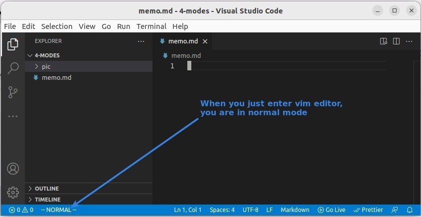
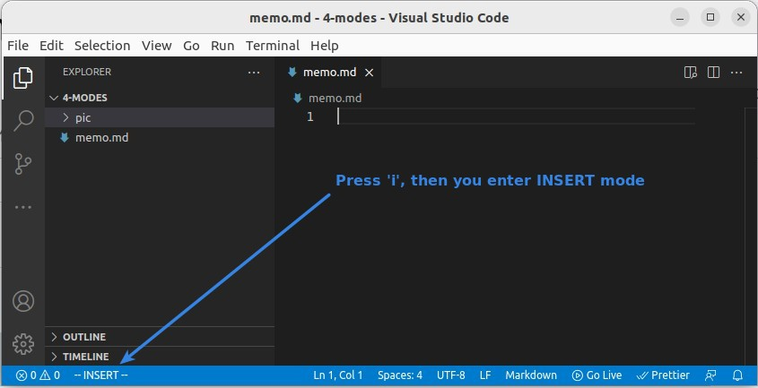
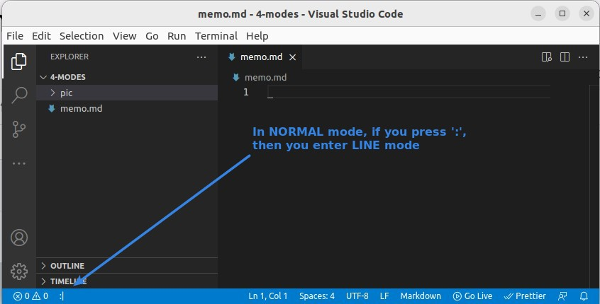

# **_Modes_**

> Normal Editor will enter the edited document no matter what you type in, but this is not the case with vim.

## **NORMAL Mode**

- After entering vim editor, you will be in NORMAL editing mode.
- In NORMAL editing mode, any input is treated as a command.
  - Vim commands are case-sensitive.

## **INSERT Mode**

- Enter lowercase i in NORMAL mode to enter INSERT mode.
- Anything entered in INSERT mode will be entered into the text.
- Press ESCAPE to exit INSERT mode and return to NORMAL mode.

## **LINE Mode**

- In NORMAL mode, enter a colon : Enter LINE mode.
- In NORMAL mode, your cursor will be at the last line, where you can enter some commands to perform some operations.
  - For example, saving a file or moving to a specific location in an article.
- Press ESCAPE to exit INSERT mode and return to NORMAL mode.

## **Other Tips**

- There are other modes among them, but they are really only minor variations of these three main modes.
- You can press ESCAPE in any mode to return to NORMAL mode.
