## **x and X**

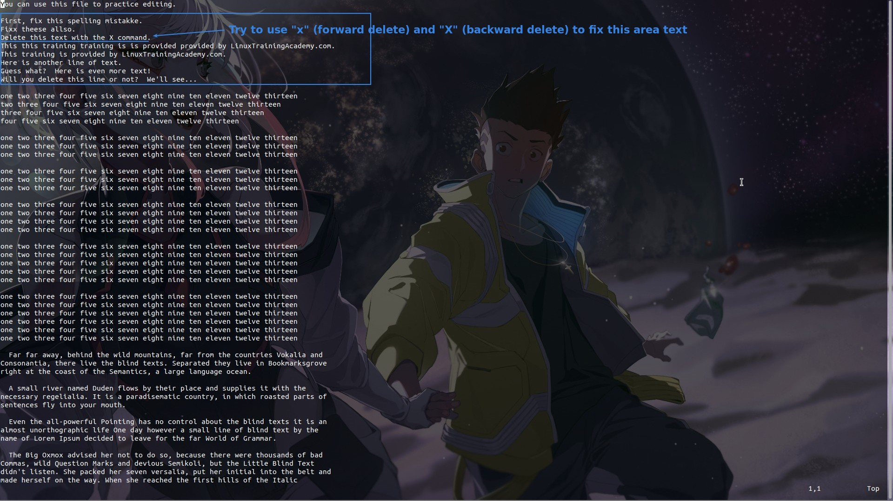

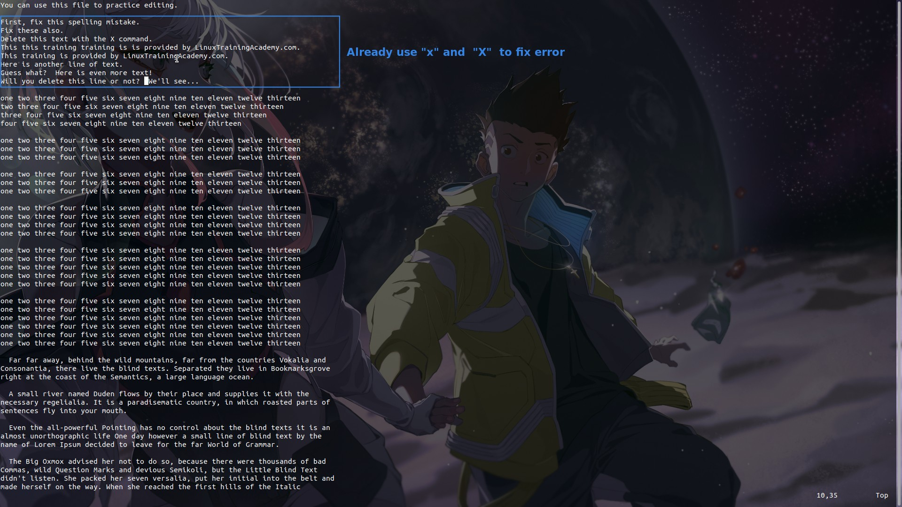

- Note that "x" will be deleted from its own position backwards, while "X" will be deleted from the previous word and will not delete the word itself.

## **operation{motion}**

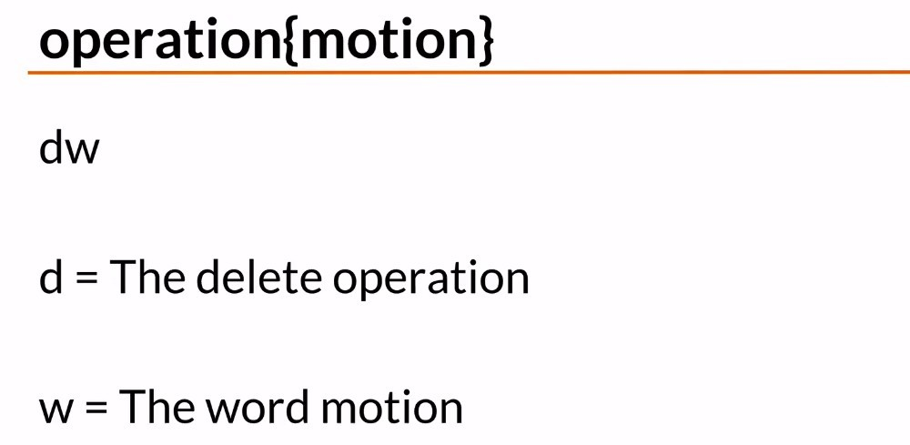

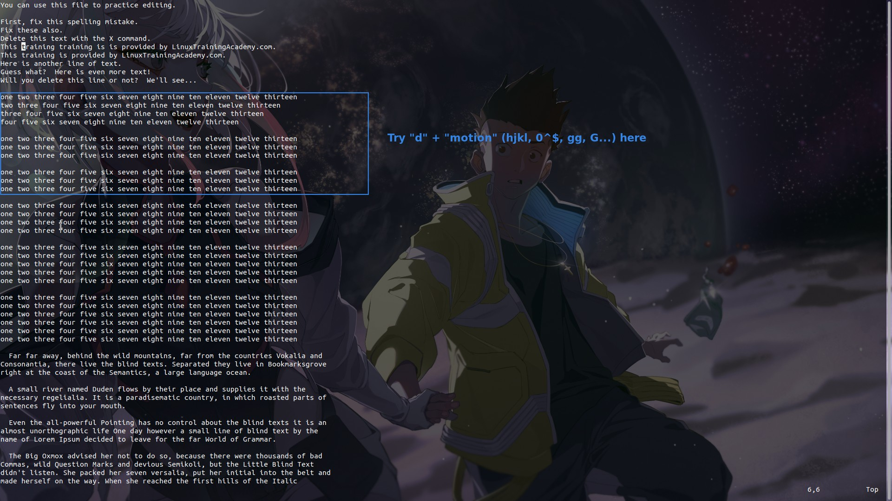

- You can find that the results of "dl" and "x" are exactly the same, and it is very common that you can do the same thing with different commands in vim.
  - You can imagine that "x" is a simple version of "dl".

## **dd and \[count\]**

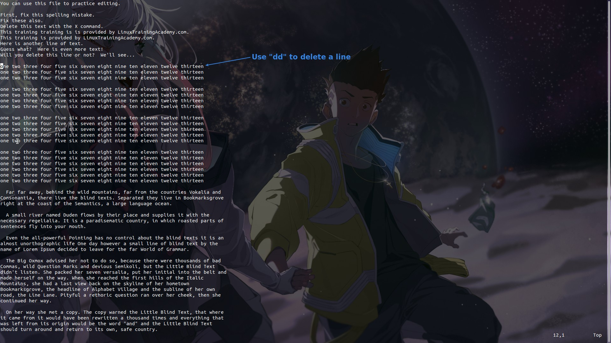

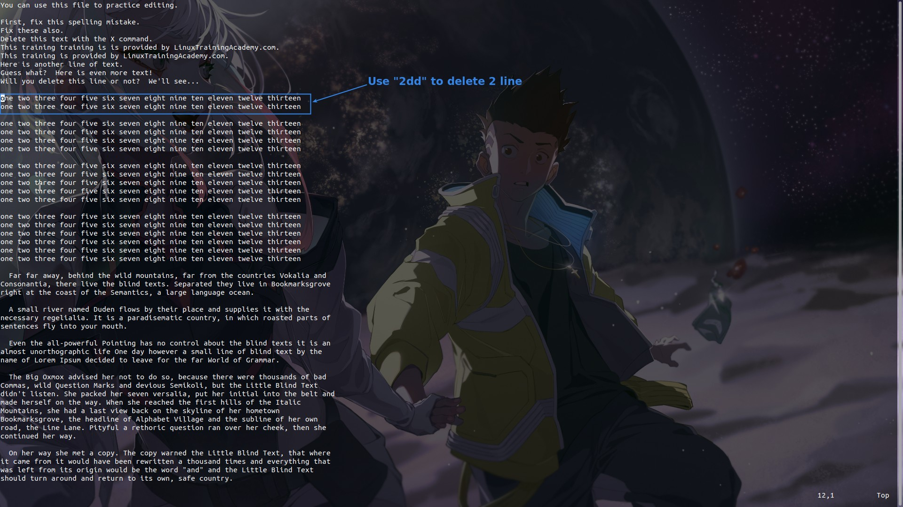

- From the above syntax, we can use "count" to determine the number of operations.

## **\[count\]opeartion\[count\]{motion}**

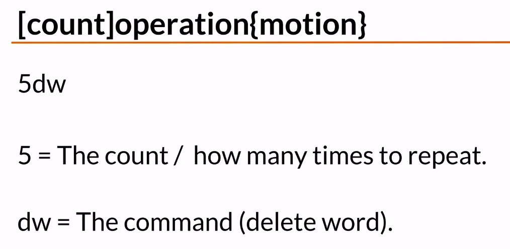

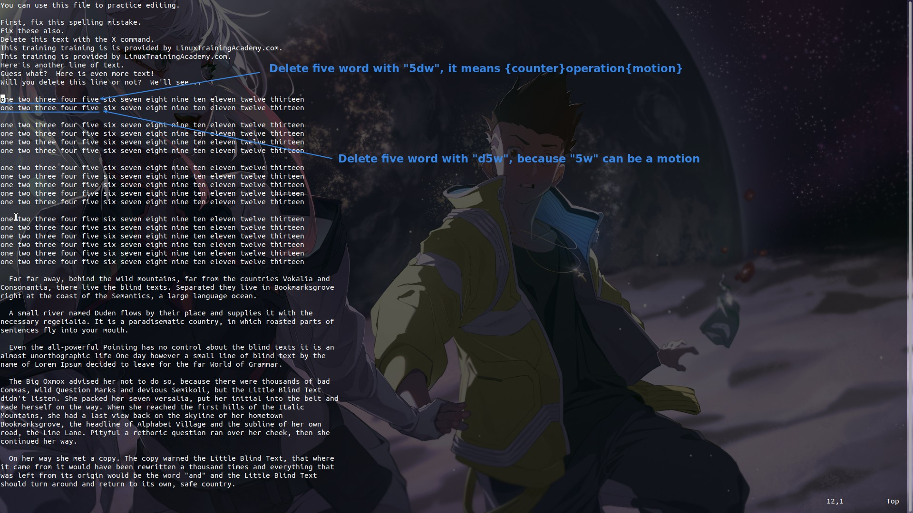

![Alt [count]operation[count]{motion}](pic/10.jpg)

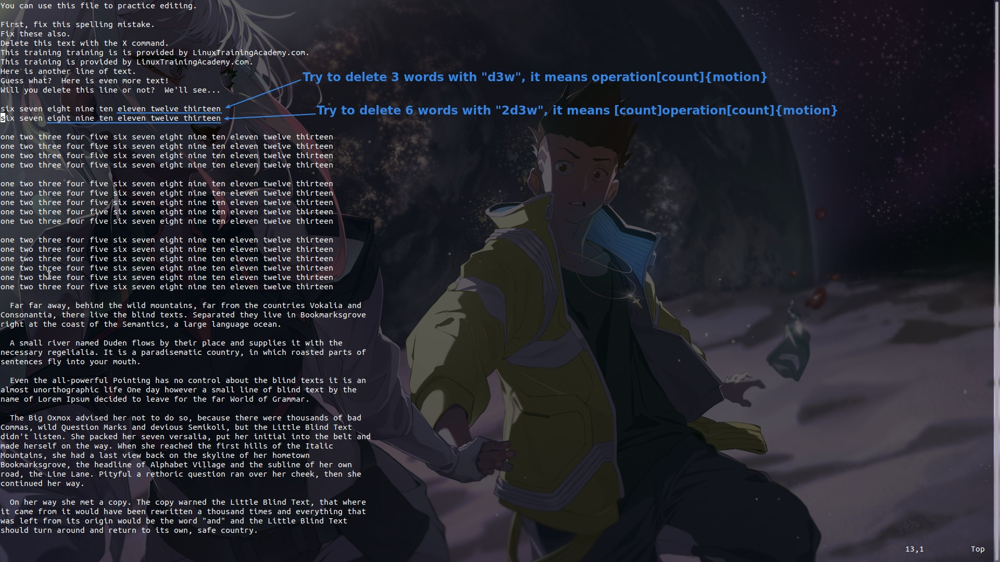

## **dot "." = repeat last operation**

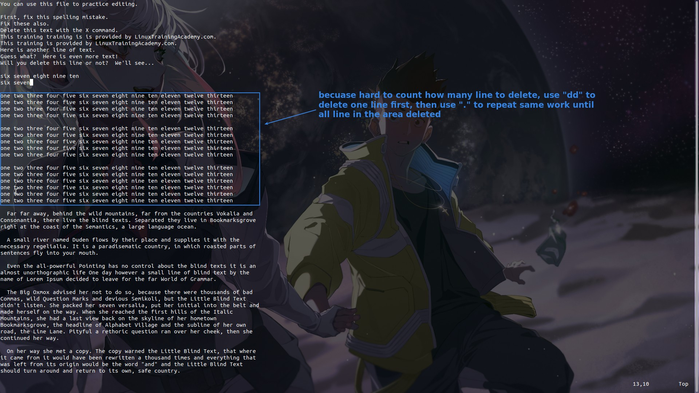

## **"!" means?**

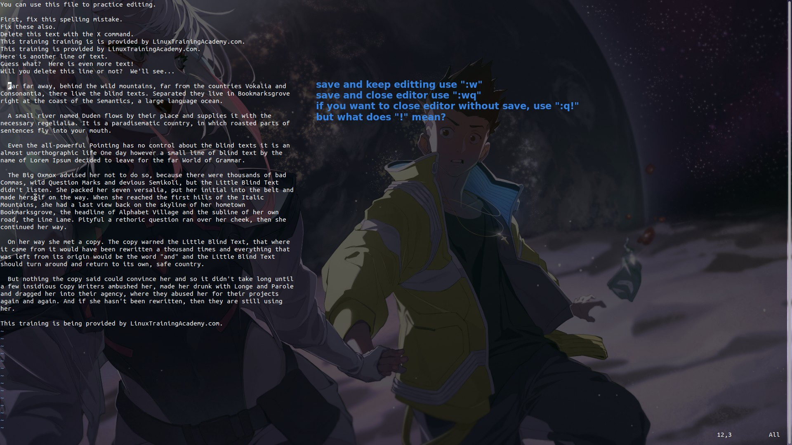

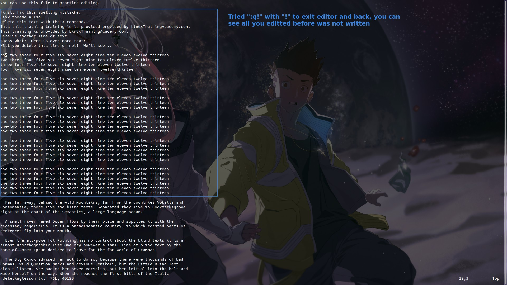

- From the above, it is clear that "!" is the meaning of forced.
