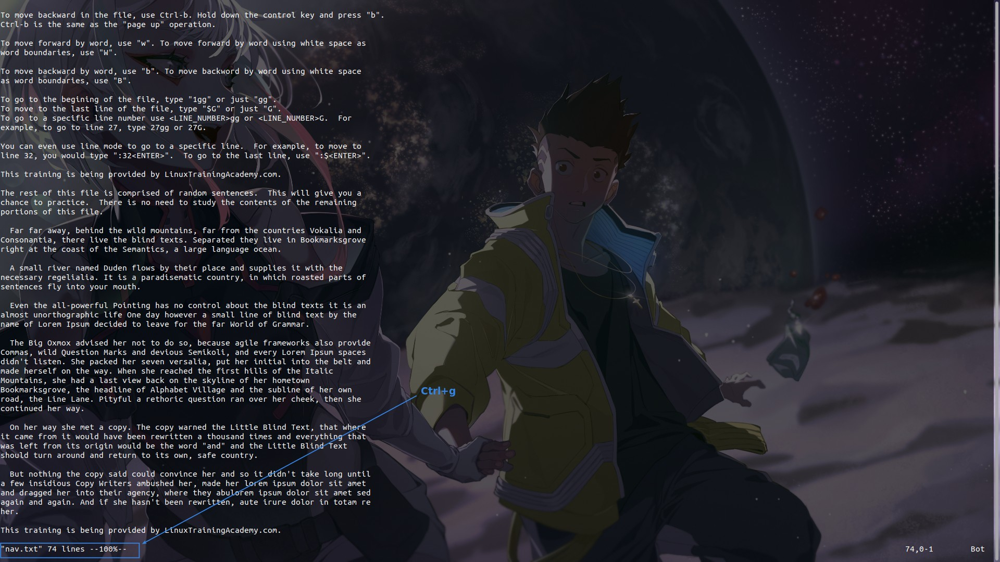

## **Basic Navigation: 4 Directions**

- How to memory four keys:

	- h - left one, so use it to move left.

	- l - right one, so use it to move right.

	- j - Looks like a fish hook, the fish hook to put down to the bottom of the sea fishing, so use it down.

	- k - only left one direction up.

- Press and hold the button is very practical, do not need to use a special way to look skillful.

## **Pagination**

- Ctrl+F, F means forward, so use it to next page.

- Ctrl+B, B means back, so use it to last page.

## **End of Text**

- At the end of the article, ~ means not part of the article.

## **Move by Word**

- The difference between upper and lower case is that it does not stop at the punctuation mark.

- The command buttons have similar functions for the same letter case, but are subtly different from each other, and are designed this way in many places.

## **Center Line**

- Moving the line of the cursor position to near the top or near the middle may be different for each person, and this is related to the configuration settings.

## **Move to Specific Places of A Line**

- ^ and $ are actually borrowed from the concept of regular expressions, in which ^ represents the beginning of a string and $ represents the end of a string.

## **Whole Text Navigation**

- 5gg and 5G in fact the same function, are jumping to the fifth line, gg and G will have differences only when not used with the number.

- G and :$ have the same effect, just using a different mode.

## **Cursor Place Information**

