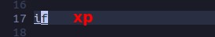

# **Concept**

- default register = unnamed register.

# **_Delete & Put_**

## **Move a line**

## **Switch lines**

> Commonly used, can remember keys directly.

## **Cut then multi paste line**

## **Switch char**

### _single_

> Commonly used, can remember keys directly.

### _multiple_

## **Move tail to head of line**

# **_Yank & Put_**

## **Dupe word**

### _single_

### _multi_

## **Dupe line**

### _single_

### _multiple_

# **_Undo & Redo_**

