## **Concept**

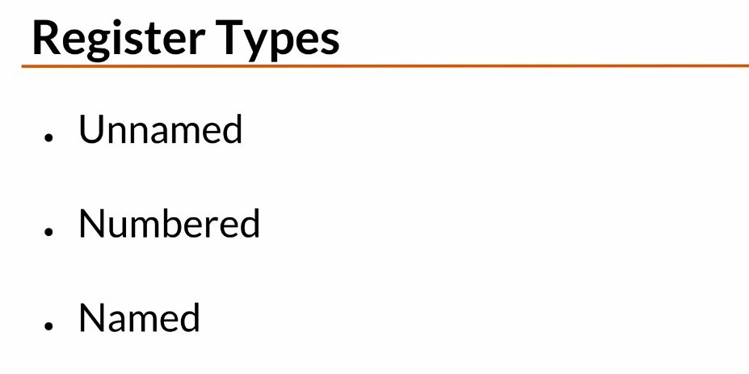

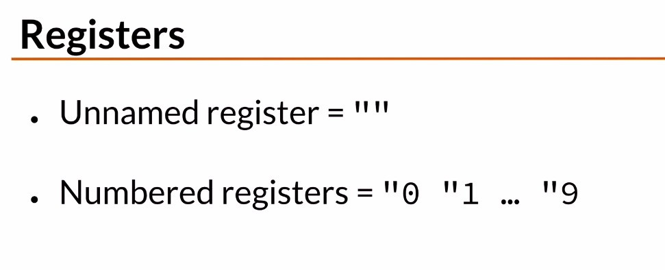

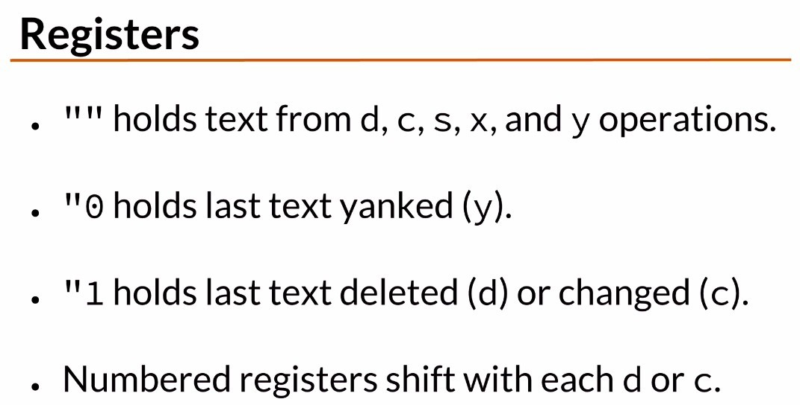

## **yank to "" & "0**

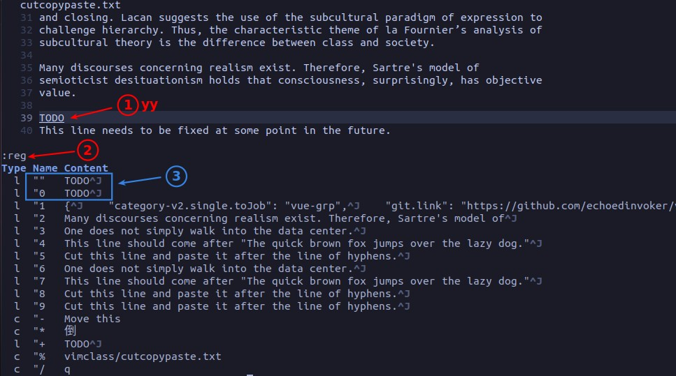

## **Delete to "" & "1~9**

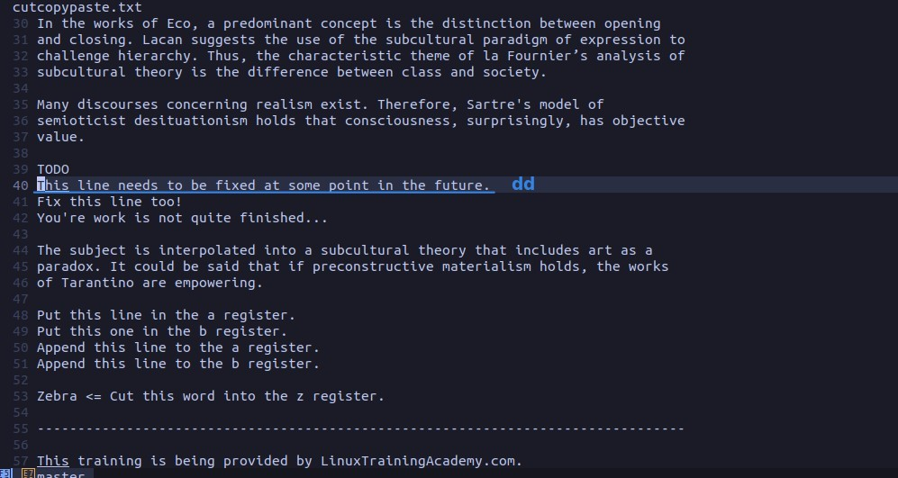

### _numbered register shift_

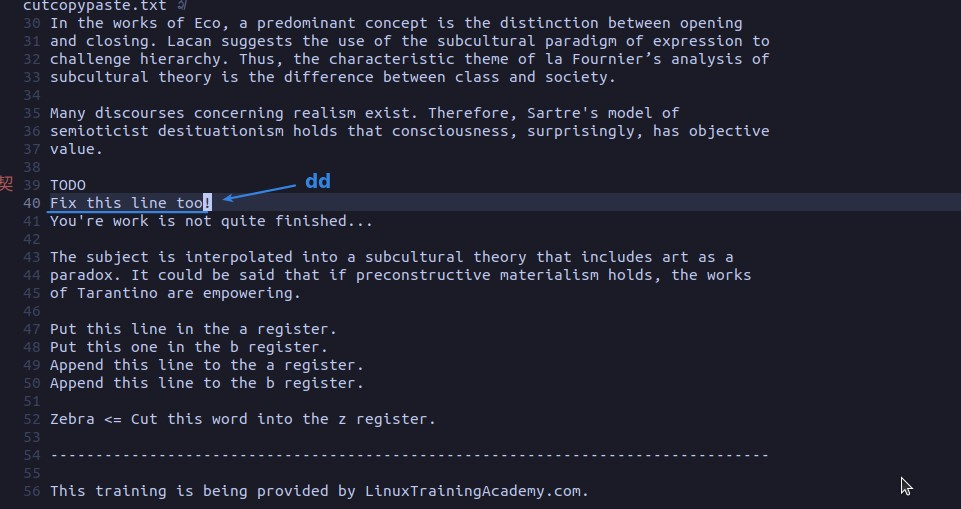

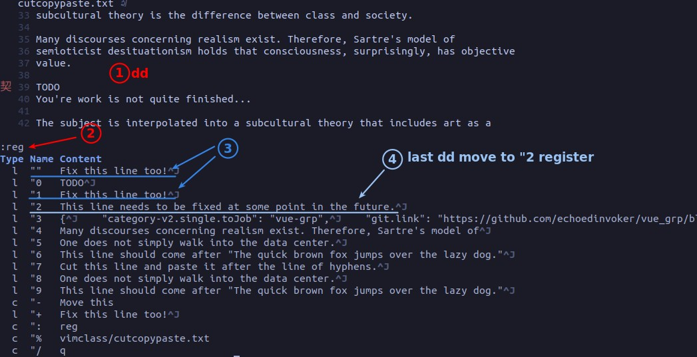

## **"a~z**

### _replace_

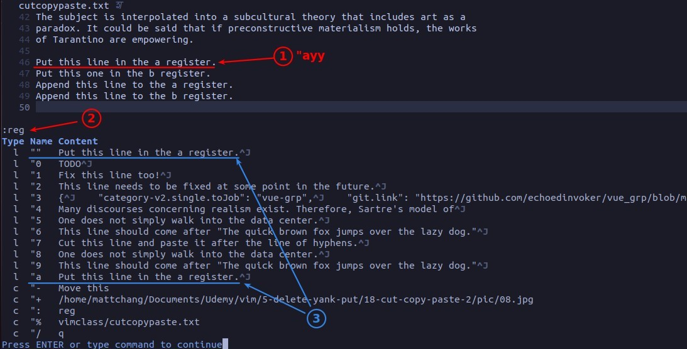

### _append_

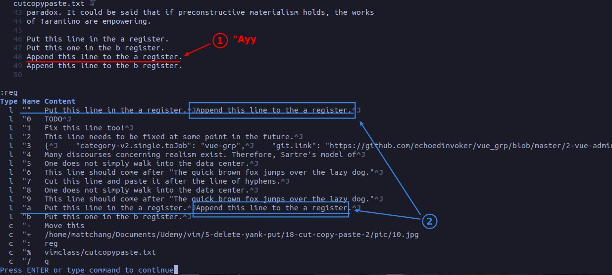

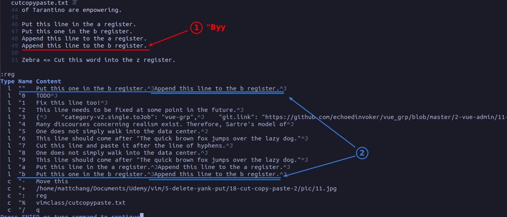

### _word_

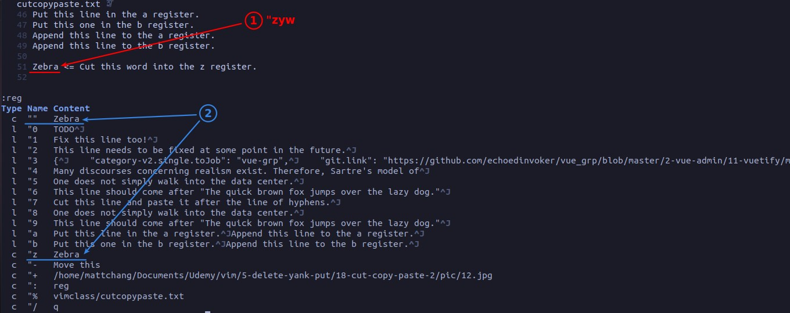

## **count & register**

### _concept_

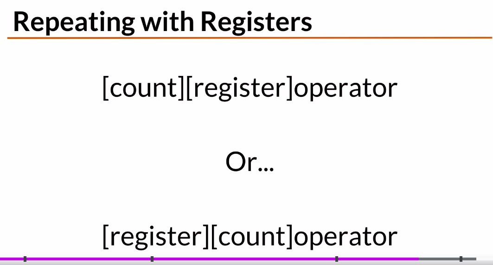

### _example_

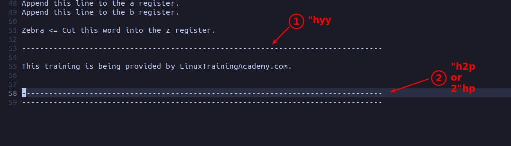

- The above is a very practical example, we can record common things such as the above separator in the Named register, and put with count.
