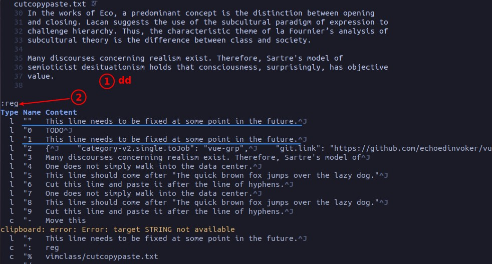
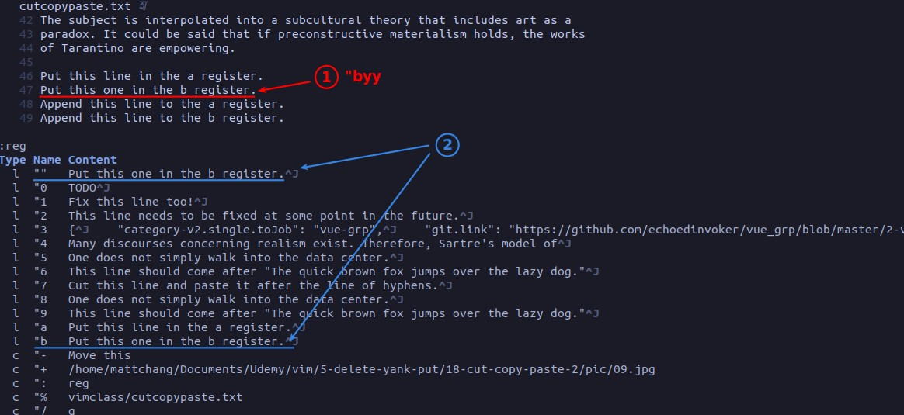

## **Concept**

## **yank to "" & "0**

## **Delete to "" & "1~9**

### _numbered register shift_

## **"a~z**

### _replace_

### _append_

### _word_

## **count & register**

### _concept_

### _example_

- The above is a very practical example, we can record common things such as the above separator in the Named register, and put with count.
