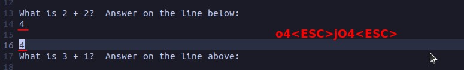
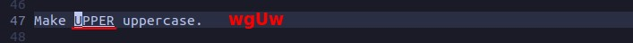

## **Insert**

### _with [count]_

![Alt [count]i [count]o](pic/12.jpg)

## **Replace**

### _R_

> Pressing R will enter replace mode, which will overwrite any word in this mode.

### _r_

> Replaces only one word and automatically returns to normal mode.

## **Change**

> When the length of the string we are replacing is different, we usually do not use replace but change.

## **Case**

### _~_

> Switching fonts case.

### _Uu_

> U = uppercase, u = lowercase

## **Join**

- As shown above, the normal join will automatically add spaces.

- When no space is needed, an additional 'g' is required.

